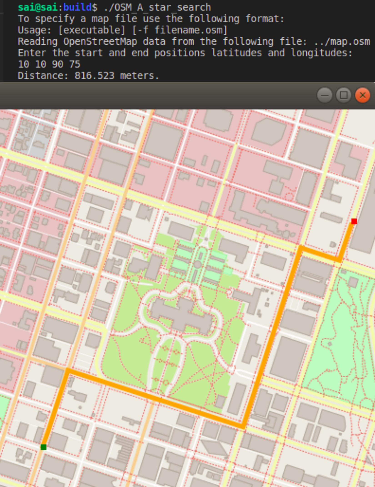
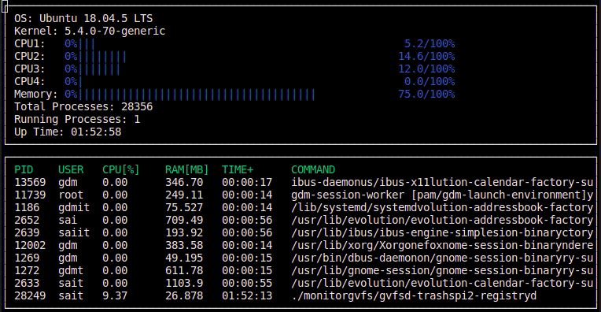
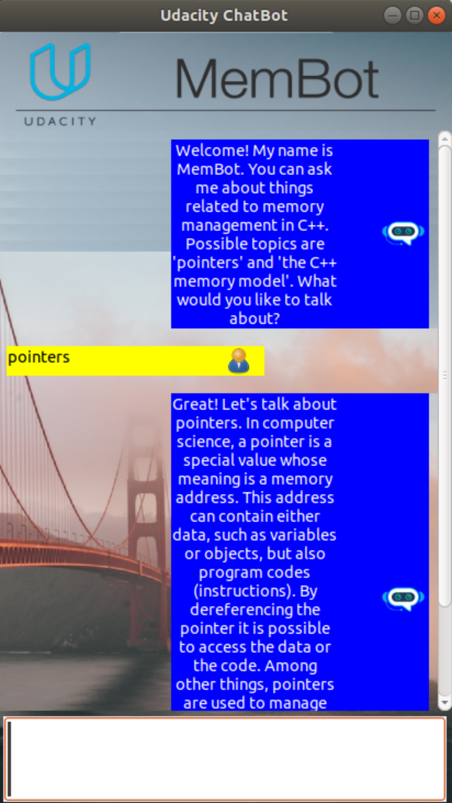

# CPP Nanodegree by Udacity
This C++ Nanodegree course is a hands-on method of learning C++ programming language by coding five real-world projects. During the course of the project I have learnt and put the learnings into practise by building a route planner using OpenStreetMap data, creating a process monitor (similar to the famous htop program on Linux devices) for computer, and used smart pointers for efficient memory management. The course concluded after successfully showcasing all the newfound skills by building a multithreaded traffic simulator and coding my own C++ application.

## My own applications
[Mandelbrot set](https://github.com/logicatcore/Mandelbrot) and [Tron Legacy game](https://github.com/logicatcore/Tron-Legacy-Game)

## Concepts learned
* Foundations course
  * Scopped enums
  * Vectors
  * algorithm standard library
  * Build systems
  * References v/s Pointers, etc.,
* Obejct Oriented Programming (OOP) course
  * Structures
  * C++ access modifiers
  * Classes
  * Abstraction, Encapsulation, Inheritance, Overloading, Polymorphism, and Interfaces
  * Namespaces
  * friends
  * Initializer list
  * Static members and methods, etc.,
* Memory Management
  * RAII (Resource Acquisition is Intialisation)
  * Heap v/s Stack
  * Smart pointers
  * R-values and R-value references
  * Rule of 0, 3 and 5
  * Resource copying policies
  * Memory fragmentation, Segmentation faults, Memory leaks, Dangling pointes
  * Circular references, etc.,
* Concurrency
  * Mutexes and locks
  * Threads v/s Tasks
  * Multithreading programming
  * Data races
  * Condition variables
  * Message queues
  * Promises and Futures, etc.,

## Libraries used
* wxWidgets
* IO2D
* CppREST
* PugiXML
* Google test suite
* Boost
* OpenCV
* GraphicsMagick
* Ncurses, etc.

## The following four projects correspond to each course part of the Nanodegree program
### Foundations course project
Objective - Use Openstreet map data to implement the A-star search algorithm to find the shortest route from origin to destination

The final application can be run as follows, which takes 4 coordinate values in the range [0-100] and finds the shortest route using the A-star search algorithm and draws the found path on to the map as to be seen here-

### Object Oriented Programming course project

Objective - Use the OOP concepts learned to create a process and resource monitor similar to the famous "htop" program in Linux devices.

I have managed to go beyond the basic expectations of the project and implemented a completely dynamic resourse and process monitor coupled with testing using the Google test suite. The process monitor in action can be seen here-

### Memory management course project

Objective - Use smart pointers, rule of 5 and rvalues appropriately to reduce the memory usage and increase the efficiency.

The memory bot (named so because it provides information regarding memory topics) looks as follows-

### Concurrency course project

Objective - Use the concepts of mutexes, locks, tasks, and threads to run a linear vehicle model for each of the vehicle and control the traffic lights to run a concurrent traffic simulation.

The traffic simulation in action can be seen here-

