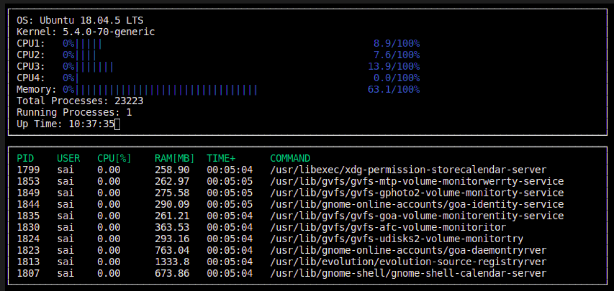

# Note
1. GTest test scripts are also included, although they do not exactly verify any values because the almost all the process related values keep varying, they are intended to check the functionality of each function in LinuxParser class.
2. A new target called build_test is added to the makefile to help running tests

# Additional features implemented
1. Dynamic usage of CPU cores
2. Sorting of processes based on CPU utilisation
3. Code adapts to the number of cores present on a system
4. build_test and build_debug targets are added to help in testing and debugging

# To run
```shell
$ cd CppND-System-Monitor
$ make build
$ ./build/monitor
# or
$ cd CppND-System-Monitor
$ make build_test # configured to also run tests after a successful build
$ ./build/monitor
```

# Monitor


